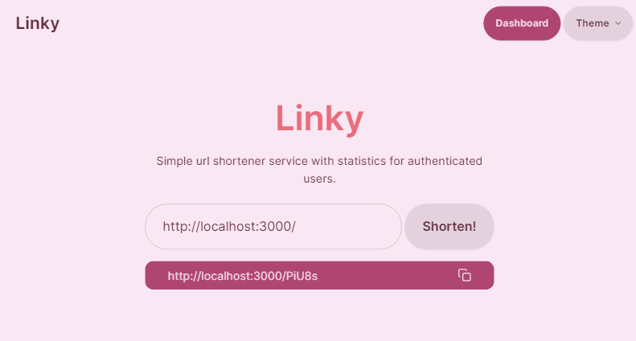
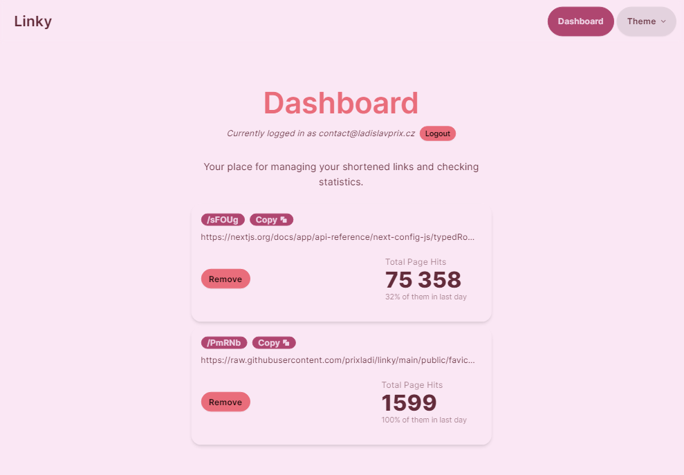

# Linky

Simple url shortener service with statistics for authenticated users.

## Development

1) Set up a instance of the PostgreSQL database. For example the [Vercel postgres](https://vercel.com/docs/storage/vercel-postgres) has a free tier.
2) Set up `.env.local` file:
    - DB_CONNECTION_STRING=(PostgreSQL connection string)
    - TOKEN_SECRET=(Secret for token signature)
3) Run:
```sh
pnpm install
pnpm dev
```

The application will start listening on port `3000`.

## Project Overview

The project is using classic Next.js app router structure with `src` folder. Pages are utilizing [Server components](https://nextjs.org/docs/app/building-your-application/rendering/server-components) and [Server actions](https://nextjs.org/docs/app/building-your-application/data-fetching/server-actions-and-mutations) whenever possible.

### Structure

- `/public` - Web root assets
- `/src` - Source code
    - `./app` - Next.js app router root, following mandatory app router structure.         
        - Folders `./**/_components` include route scoped components.
    - `./components` - Shared UI components
    - `./server` - Server logic decoupled from Next.js frontend and backend
        - `./db` - Db connection, client and models
        - `./utils` - Server internal utils 
        - `./methods` - Front facing methods containing business logic
    - `./lib`
        - `./server` - Bindings to server logics (`/src/server/methods`)
            - `./actions` - Next.js server actions
    - `./middleware.ts` - Next.js middleware handling protected routes

## Application images


